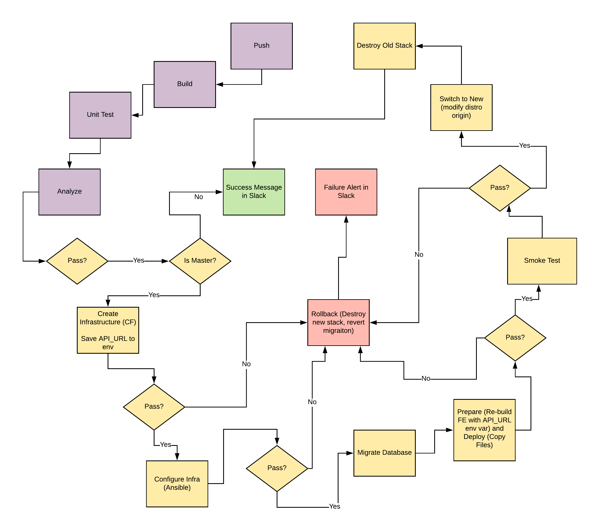

## Give your Application Auto-Deploy Superpowers

In this project, you will prove your mastery of the following learning objectives:

- Explain the fundamentals and benefits of CI/CD to achieve, build, and deploy automation for cloud-based software products.
- Utilize Deployment Strategies to design and build CI/CD pipelines that support Continuous Delivery processes.
- Utilize a configuration management tool to accomplish deployment to cloud-based servers.
- Surface critical server errors for diagnosis using centralized structured logging.

### Instructions

* [Getting Started](instructions/0-getting-started.md)
* [Selling CI/CD](instructions/1-selling-cicd.md)
* [Deploying Working, Trustworthy Software](instructions/2-deploying-trustworthy-code.md)
* [Configuration Management](instructions/3-configuration-management.md)
* [Turn Errors into Sirens](instructions/4-turn-errors-into-sirens.md)

### Project Submission
For your submission, please zip up all of the 12 screenshots, and the text or presentation document, into one zip archive. In your submission you should also include a text file labeled urls.txt with the following URLs:
- Public Url to GitHub repository (not private) [URL01]
- Public Url to working CI/CD pipeline (failure-free) [URL02]
- Public URL for your S3 Bucket (aka, your green candidate front-end) [URL03]
- Public URL for your CloudFront distribution (aka, your blue production front-end) [URL04]
- Public URLs to deployed application back-end in EC2 [URL05]
- Public URL to your Prometheus Server. [URL06]

Before you submit your project, please check your work against the project rubric. If you haven’t satisfied each criterion in the rubric, then revise your work so that you have met all the requirements. 

### Built With

- [Circle CI](www.circleci.com) - Cloud-based CI/CD service
- [Amazon AWS](https://aws.amazon.com/) - Cloud services
- [AWS CLI](https://aws.amazon.com/cli/) - Command-line tool for AWS
- [CloudFormation](https://aws.amazon.com/cloudformation/) - Infrastrcuture as code
- [Ansible](https://www.ansible.com/) - Configuration management tool
- [Prometheus](https://prometheus.io/) - Monitoring tool

### License

[License](LICENSE.md)
