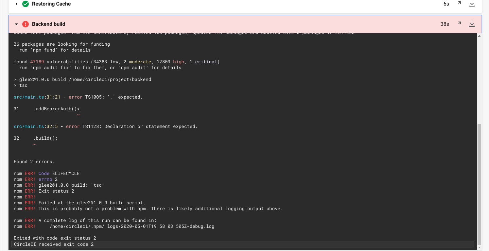
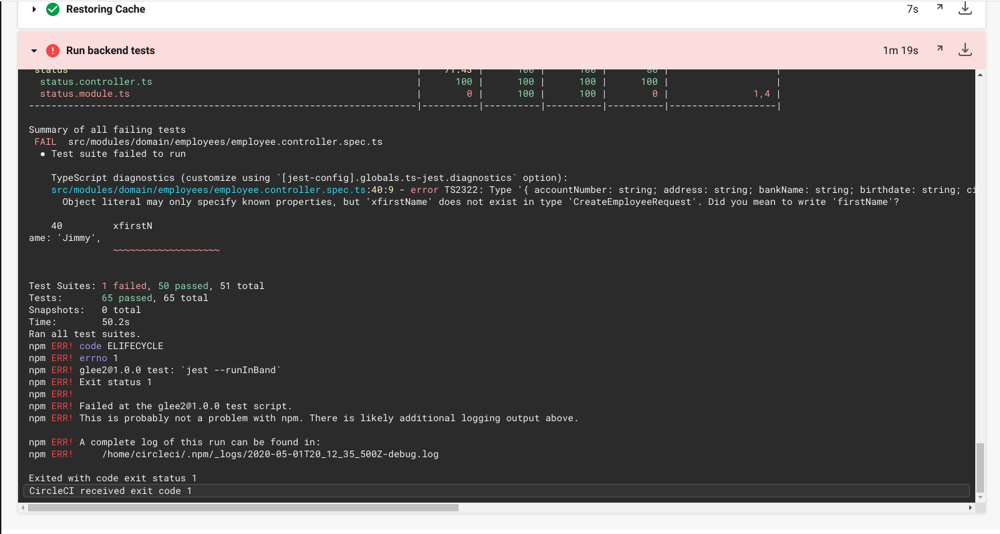
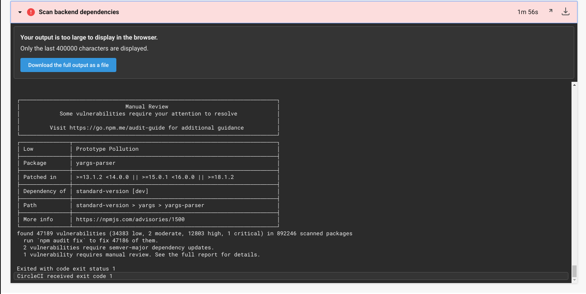
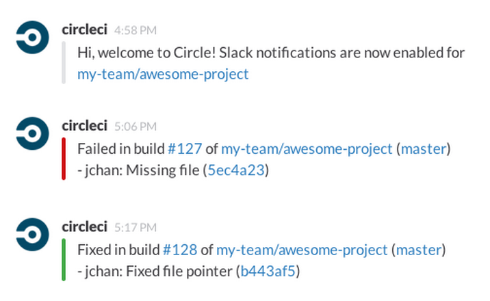

## Section 2 - Utilize Deployment Strategies to Design and Build CI/CD Pipelines that Support Continuous Delivery Processes

### Circle CI

Circle CI is but one of many options for CI/CD tools. It is a “software as a service” and has a [free account](https://circleci.com/signup/?source-button=free) that you can use throughout this project, which is ideal for UdaPeople since it’s a start-up running on a shoestring budget. 

1. [Create an account](https://circleci.com/signup/?source-button=free) with circleci.com if you haven't already. We recommend the free tier for this course. It includes 2500 credits per week which equals around 70 builds. This should be enough as long as you are conservative with your builds. _If you run out of credits, you could potentially create another account and continue working._
2. Create a new project in Circle CI using your GitHub repo.
 - Notice the `.circleci` folder. This is where your jobs will go.
3. Ensure a workflow starts with at least one “Hello World” job. If you need to take a look at some samples, Circle CI was nice enough to [give us a few](https://circleci.com/docs/2.0/sample-config).

Please watch the [video walkthrough of setting up CircleCI here](https://www.youtube.com/watch?v=SRBmYjUF-tA).

### Screenshots and URLs

Throughout this project, you will be asked to take screenshots or provide URLs to aid in the evaluation process once you're done with the project. It's worth mentioning here since it's much harder to harvest some screen shots once you've passed certain milestones. It's best if you take screenshots along the way and store them in a folder on your computer until you're ready to turn the project in. Also, it's good to keep a document or notepad with the list of urls that are requested.

### To Do

- Make sure commits/pushes to repo trigger the CI/CD pipeline (this should be automatic after connecting CircleCI to your Github repo).

#### 1. Build Phase

The goal of a build phase is to compile or lint the source code to check for syntax errors or unintentional typos in code. It’s your first line of defense against bugs as you attempt to integrate the pieces of your project together. This is especially important to UdaPeople because we don’t want to waste credits or time running other steps if the code can’t even compile.



- Add jobs to the `.circleci/config.yml` file to build/compile both front-end and back-end code (one job for each). 
- You should have separate jobs for front-end and back-end so that failure alerts are more descriptive.
- Job should fail if code cannot be compiled (fail for the right reasons). We have provided an easy-to-fix compile error in the code to prove the jobs fail. Provide a screenshot of jobs that failed because of compile errors. **[SCREENSHOT01]**
- Fix the compile error so that the pipeline can continue (see code-comment that guides you to the fix).
- A failed build should stop all future jobs.

#### 2. Test Phase

Unit tests are one of the many very important building blocks of a system that enables Continuous Delivery (notice, we didn’t say “the only or most important thing”). UdaPeople believes that tests should come first just like they do in the scientific method. So, if a test fails, it's because the code is no longer trustworthy. Only trustworthy code should get a ticket to continue the ride!



- Add jobs to the config file to run all the unit tests in both layers. The command you use to run the tests should generate some sort of test results file in a standard format. You may need to check the test runner docs for this.
- Again, this should be in separate jobs.
- A unit test job should fail the job and prevent any future jobs from running.
- Individual test failures should appear in the "Test Failures" tab. You can find instructions for how to make this happen in [Circle CI's documentation](https://circleci.com/docs/2.0/collect-test-data/). We have provided one failing test in both front-end and back-end. Provide a screenshot of the failed unit tests in the "Test Failures" tab. **[SCREENSHOT02]**
- Make sure a failed test stops all future jobs.
- Fix the unit tests and make the job succeed.

#### 3. Analyze Phase

UdaPeople handles some private information like social security numbers, salary amount, etc. It would be a shame if a package with a known vulnerability left a security hole in our application, giving hackers access to that information! That’s why we should include a job that checks for known vulnerabilities every time we check in new code.



- Add jobs to the config file to check for security vulnerabilities in the packages used in the application.
  - Create a simple job to run nodejs commands. The product `npm` comes with an “audit” feature that will check for known package vulnerabilities. Just `cd` into the directory of front-end and back-end and run the following:
```bash
npm audit --audit-level=critical
```
- Job should fail if any major vulnerabilities are found (fail for the right reasons). We left you an intentional vulnerability to cause a failure. Provide a screenshot of jobs that failed because of vulnerable packages listed. **[SCREENSHOT03]**
- Fix the vulnerability using the command below and re-run the job.
```bash
npm audit fix --audit-level=critical --force
```
- A failed analysis should stop all future jobs.

#### 4. Alerts

When a build fails for any reason, the UdaPeople dev team needs to know about it. That way they can jump in and save the day (the day that they almost ruined by checking in bad code… but we digress). We’re going to add an alert so that botched builds raise a nice wavy red flag.



- Integrate Slack, email or another communication tool to receive alerts when jobs fail. Our examples are using Slack, but you should feel free to use the communication tool to which you are most accustomed.
- Alerts should include a summary of what happened and a link to the job console output for quick troubleshooting.
- Provide a screenshot of an alert from one of your failed builds. **[SCREENSHOT04]**
