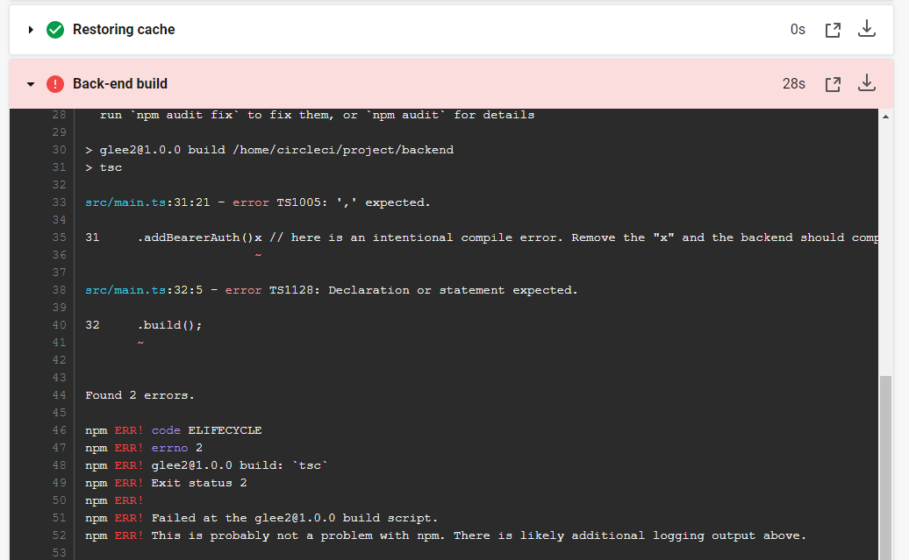
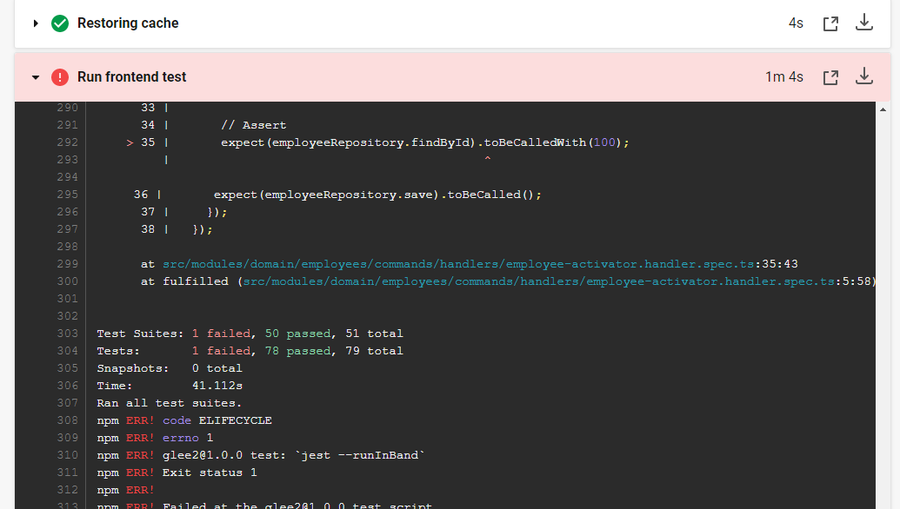
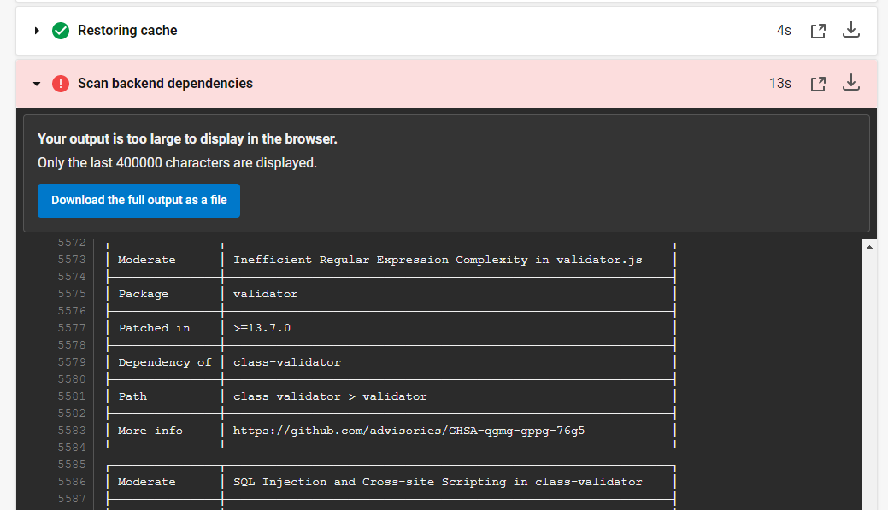
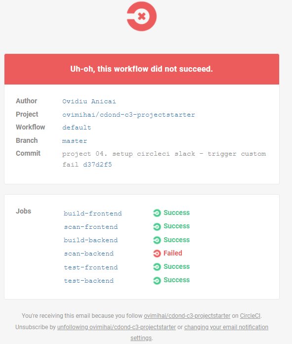
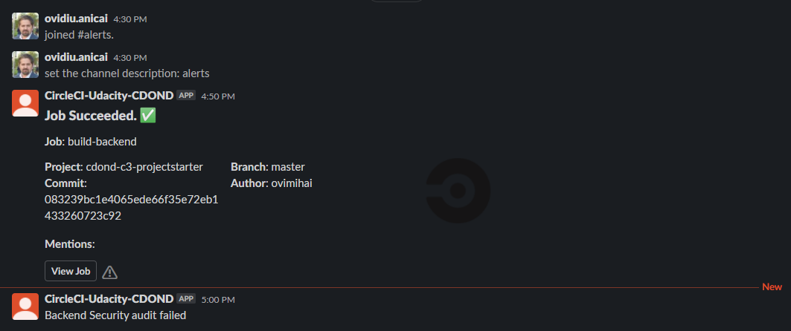
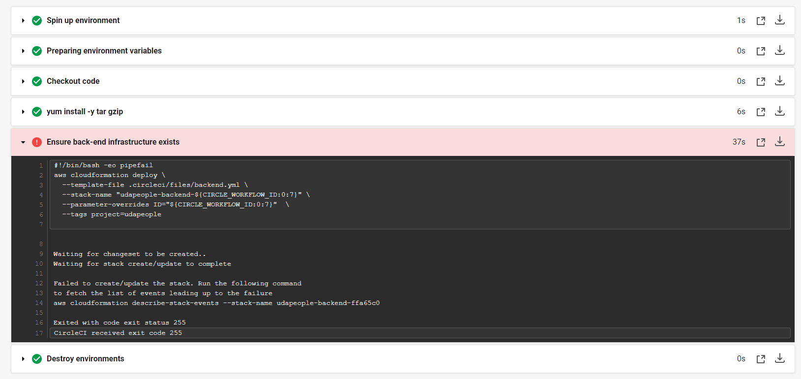
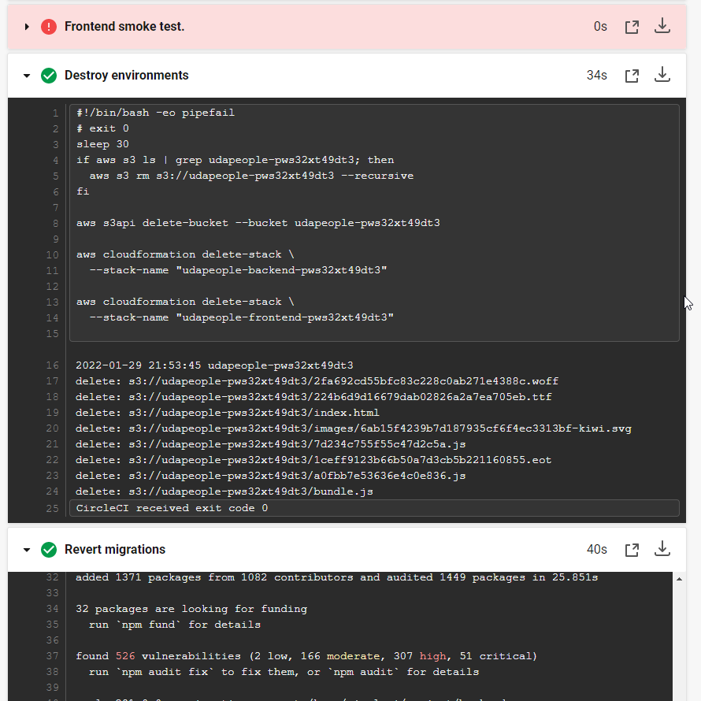

1. Job failed because of compile errors.
[SCREENSHOT01]

2. Job failed because of unit tests.
[SCREENSHOT02]

3. Job that failed because of vulnerable packages.
[SCREENSHOT03]

4. An alert from one of your failed builds.
[SCREENSHOT04]

5. Appropriate job failure for infrastructure creation.
[SCREENSHOT05]

6. Appropriate job failure for the smoke test job.
[SCREENSHOT06]

7. Successful rollback after a failed smoke test.
[SCREENSHOT07]

8. Successful promotion job.
[SCREENSHOT08]

9. Successful cleanup job.
[SCREENSHOT09]

10. Only deploy on pushed to master branch.
[SCREENSHOT10]

11. Provide a screenshot of a graph of your EC2 instance including available memory, available disk space, and CPU usage.
[SCREENSHOT11]

12. Provide a screenshot of an alert that was sent by Prometheus.
[SCREENSHOT12]

13. Provide a screenshot showing the evidence of deployed and functioning front-end application in CloudFront (aka, your production front-end).
[URL03_SCREENSHOT]

14. Provide a screenshot showing the evidence of a healthy backend application. The backend endpoint status should show a healthy response.
[URL04_SCREENSHOT]

15. Provide a screenshot of your Prometheus server showing UP state
[URL05_SCREENSHOT]
